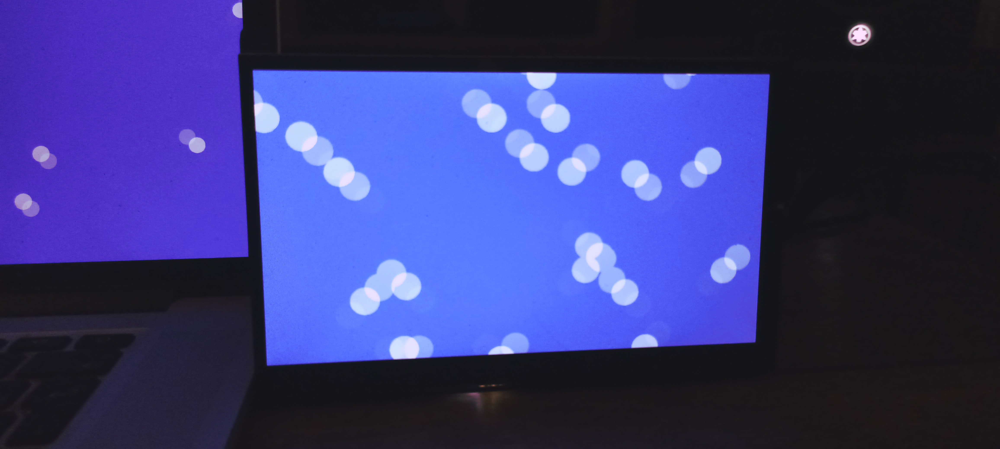

# srm-skia

[SRM](https://github.com/CuarzoSoftware/SRM) example using Skia as renderer.



### Build

```bash
$ cd srm-skia
$ ./get_and_build_skia_here.sh
$ meson setup build
$ cd build
$ meson compile
```

### Run

Switch to a free TTY, then:

```bash
$ ./srm-skia
```